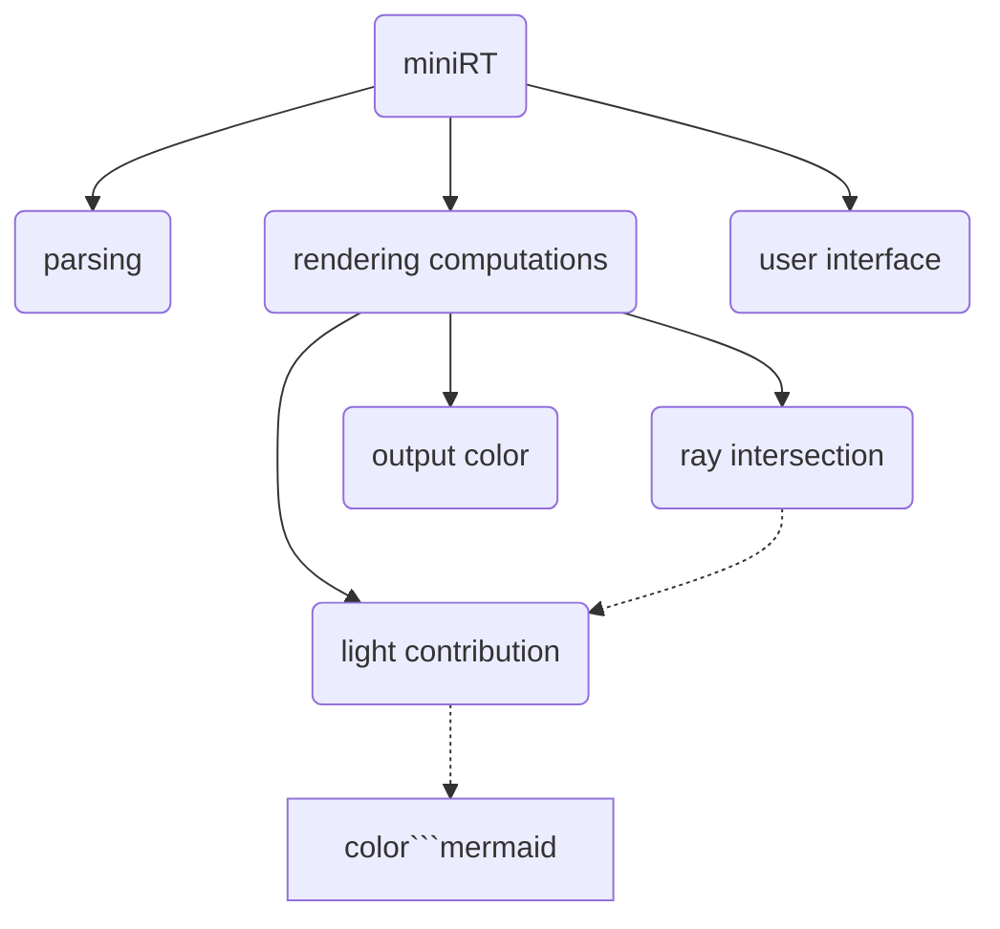

# Introduction
Create a small raytracer able to render a small set of geometrical objects, like
spheres, planes and cylinder.

![earth and moon in the sky][earth_moon]
![many geometric forms][geometric]

<!-- markdown-toc start - Don't edit this section. Run M-x markdown-toc-refresh-toc -->
**Table of Contents**

- [Introduction](#introduction)
- [Features and strategy](#features-and-strategy)
    - [Mandatory](#mandatory)
    - [Special features](#special-features)
        - [Computationnal acceleration](#computationnal-acceleration)
        - [Textures and bumpmaps](#textures-and-bumpmaps)
        - [Anti-aliasing](#anti-aliasing)
- [Use](#use)
    - [Compile and use](#compile-and-use)
    - [Configure](#configure)
    - [From inside:](#from-inside)
- [Some pictures](#some-pictures)
- [Thanks](#thanks)

<!-- markdown-toc end -->

# Features and strategy
## Mandatory
The aim of that project was to create a small raytracer, able to render various
of simple sets of scenes. Thus we chose to decouple the process as much as we
could, to make it more modular and easy to improve.



This architecture allowed us to be really modular: adding a new geometric object
leads only to add a new description of the intersection with the ray an the
related properties of that intersection.

## Special features
### Computationnal acceleration
We used a [Phong reflexion
model](https://en.wikipedia.org/wiki/Phong_reflection_model), allowing an easy
computation, with a still realistic rendering. Thank to that, we were able to
put a mask on the camera/the light, to determine with really few computation if
a given ray would have a chance to intersect a given object, and thus spare the
intersection calculation time.

### Textures and bumpmaps
Even we had tools to read _xpm_ images, we prefered to create our own image
parser. Thus, we learned to parse and read as underset of the _tiff_ format
images, which has the posibility to store uncompressed images. This was done
using the [standard
description](https://www.itu.int/itudoc/itu-t/com16/tiff-fx/docs/tiff6.pdf) and
has been the opportunity to learn more about how to parse a binary file and how
such standard can work.

With that new knowledge, we choosed to add the possibility to export the current
rendering image as a tiff[^1].

### Anti-aliasing
This was archived by sending 100 rays per pixel, with a randomized distribution
over that pixel.

# Use
## Compile and use
You have a bundle of 3 version of the project, but I still recommand to use
either the bonus version (complete and fast) or the antialiasing version
(complete and slow).

``` bash
make -j bonus abonus
```

Then launch the program as

``` bash
./miniRT_bonus [filename.rt]
./demo/demo.sh
```

## Configure
I will describe here only the bonus and the abonus versions as they use the same
format and allow more flexibility.

| tag    | description   | format                      |
|--------|---------------|-----------------------------|
| ca     | camera        | pos dir fov                 |
| A      | ambiant light | intensity color             |
| l      | light         | pos intensity color         |
| sp     | sphere        | pos radius color            |
| cy     | cylinder      | pos dir radius length color |
| pl     | plane         | pos dir color               |
| tr     | triangle      | pos pos pos color           |
| hb     | hyperboloid   | pos dir radius length color |
| \_te\_ | texture       | path                        |
| \_bm\_ | bumpmap       | path                        |

Any object has 3 optionnal parameters describing the texture (replacing the
color), the bumpmap and the checkboard status.

from _demo/cylinder.rt_[^2]:
```
ca 0,0,0     1,0,0  70

A           0.2    255,255,255
l 0,-3,9    1.0    255,255,255

pl 0,0,-2   0,0,1  255,255,255

cy 5,2,0 1,0,0.2  1 1 255,255,255 0 0
hb 7,-3,4 0,0,1 1  1 255,255,255 0 0 1
cy 4,0,-2 -0.2,0,1 2 2 255,255,255 0 0 1

_te_ ressources/textures/earthmap.tiff
_bm_ ressources/bumpmaps/earthbump1k.tiff
```

## From inside:
_The interactions are mapped on an qwerty keyboard._
You can run this program, as you would have a camera on your shoulder an be able
to go around in the scene, thus you are able to:
 - move in the camera plane with the arrow keys
 - zoom in/out with zx
 - look around with wasd
 - rotate with qe
 - all this can be done with the mouse: left clic -> camera pitch / right clic
   -> camera move / scroll -> zoom
 - esc to quit

A really nice feature is the menu (tab key) you can choose an element/a propery
with the arrow keys, change it by hitting the number bar (not the numpad),
change the element category with Ctrl+l/r arrowkey. Just kit enter to validate
and tab to escape the menu.

# Some pictures
Try the colors:

![sphere form different colors with many spotlights][lights]

Without/with antialiasing:

![scene without antialiasing][no_aa] ![scene with antialiasing][with_aa]

# Thanks
Special thanks to [JamesGarrigou](https://github.com/JamesGarrigou "Romain") for
his really nice parsing and the amazing menu he added to be able to change any
property while the program is rendering.

[^1]: working for 720x480 images for now
[^2]: you need to first decompress the texture folder using `tar axf textures.tar.gz`

[earth_moon]: /ressources/screenshots/planete.png "Rendering of the earth and the moon"
[geometric]: /ressources/screenshots/geometric.png "sphere cylinder planes and hyperboloid"
[lights]: /ressources/screenshots/light-colors.png "spheres of different colors under spotlights"
[no_aa]: /ressources/screenshots/noantiall.png "No antialiasing"
[with_aa]: /ressources/screenshots/antiall100.png "100 ray per pixel"
